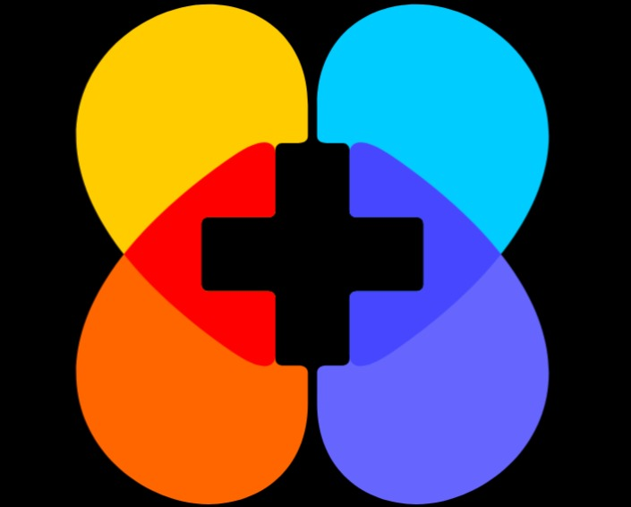

# 💫 About Me:
# Yukti Care 🌸 ### Empowering Sustainable Menstrual Hygiene Through Accessible Supply Chains  ## 📌 Problem Statement Reusable menstrual products such as menstrual cups, reusable pads, and period panties significantly reduce waste and long-term costs. However, these products are mostly available online, which limits access for rural communities and users with low digital literacy.  ## 💡 Solution **Yukti Care** is a mobile application designed to bridge this gap by enabling **pharmacies, medical distributors, and Self-Help Groups (SHGs)** to place **bulk orders** and **manage inventory** of reusable menstrual products through a **simple, offline-friendly system**.  The platform improves availability, strengthens last-mile distribution, and promotes sustainable menstrual hygiene practices in underserved regions.  ---  ## 🚀 Key Features - 📦 Bulk ordering of reusable menstrual products   - 📊 Inventory tracking for pharmacies and SHGs   - 📴 Offline-first functionality for low-connectivity areas   - 👥 Role-based access (Pharmacies, Distributors, SHGs)   - 🔔 Notifications & order status updates   - 💳 UPI-based payment support   - 🔐 Secure data handling    ---  ## 🛠️ Tech Stack  ### Mobile Application - **Flutter** – Cross-platform UI framework   - **Dart** – Application programming language   - **Android SDK** – Native Android integration    ### Backend & Services - **Firebase** – Authentication, database, and cloud services   - **Twilio** – SMS and communication services   - **UPI Integration** – Secure digital payments   - **Together AI API** – Intelligent recommendations and insights    ---  ## 🎯 Target Users - Pharmacies   - Medical distributors   - Self-Help Groups (SHGs)   - Rural healthcare supply networks    ---  ## 🌱 Impact - Improves access to sustainable menstrual products in rural areas   - Reduces dependency on disposable sanitary products   - Lowers long-term costs for users   - Supports women-led SHGs and local distribution networks   - Promotes environmentally responsible menstrual hygiene    ---  ## 📱 Platform Support - Android (primary) - Flutter-based architecture allows future expansion to iOS & Web  ---  ## 👨‍💻 Developer **Sandeep Kumar Swain**   B.Tech | Flutter Developer | Problem Solver    ---  ## 📜 License This project is licensed under the **MIT License**. 

## 📸 App Screenshots

# 💻 Tech Stack:
    
# 📊 GitHub Stats:
 
 

---

  ## 💰 You can help me by Donating
   

  
<!-- Proudly created with GPRM ( https://gprm.itsvg.in ) -->
